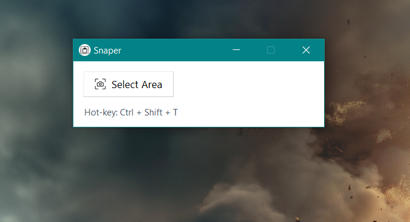

# 🖼️ Snaper – Screen Text Capture Tool

**Snaper** is a lightweight, open-source Windows application that lets you **select any part of your screen and instantly extract text** using Tesseract OCR. Built with Python and Tkinter, it's simple, fast, and offline-capable.

> ⚡ **Hotkey:** `Ctrl + Shift + T`  
> 📋 Text is automatically copied to your clipboard!

---

## ✨ Features

- 🖱️ Click or hotkey to capture screen area
- 🧠 OCR powered by Tesseract (offline, fast)
- 📋 Clipboard-ready results
- 🎨 Minimal and clean UI (TTK styling)
- 🔥 Works as a portable `.exe`
- 💻 Open source and fully customizable

---

## 📦 Download

➡️ [**Download latest Snaper_Installer.exe**](https://github.com/dhruvpuri-goswami/snaper/releases/latest)

> You can install the app on Windows without needing Python or any external dependencies.

---

## 🛠 Tech Stack

- Python 3.11+
- Tkinter (TTK themed widgets)
- Tesseract OCR (`pytesseract`)
- PyAutoGUI (for screen capture)
- Pillow (for image handling)
- Keyboard (for global hotkey)
- PyInstaller (for packaging)

---

## 💻 Running from Source (for Developers)

```bash
git clone https://github.com/dhruvpuri-goswami/snaper.git
cd snaper
python -m venv venv
venv\Scripts\activate         # or source venv/bin/activate (Linux/macOS)
pip install -r requirements.txt
python main.py
```

---

## 📸 Screenshot

> 



---

## 🤝 Contribute to Snaper!

Snaper is open for improvements and contributions!

If you'd like to:

- 🔧 Fix a bug
- 🎨 Improve the UI
- 💡 Suggest new features
- 🔁 Refactor or optimize the code

You're welcome to fork the repo, improve it, and send a **pull request**.

> Let’s make Snaper even better — together 💙

---

## 📄 License

This project is licensed under the [MIT License](LICENSE).  
Feel free to use it in your own projects or modify it for your needs!

---

## 🙌 Credits

- [Tesseract OCR](https://github.com/tesseract-ocr/tesseract)
- [PyAutoGUI](https://github.com/asweigart/pyautogui)
- [Pillow](https://github.com/python-pillow/Pillow)
- [Tkinter](https://docs.python.org/3/library/tkinter.html)
